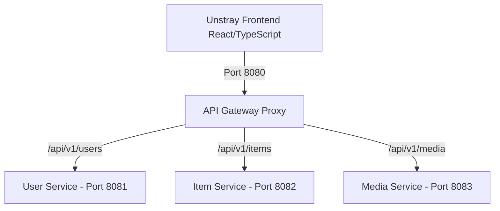

# Unstray lost & found platform - Frontend

Unstray is a cloud-native, high-trust Lost & Found platform built for modern campuses, corporate hubs, and smart cities. It reconnects lost belongings with their owners through intelligent visual discovery, similarity matching, and verified user profiles.

## Student & Project Information
* **Student Name:** Kamesh Nethsara
* **Student ID:** 241722037

## Deployment Information
- **GCP Project ID:** `unstray-506517`
- **Live Frontend URL:** `http://8.232.243.40/`

## Architecture Overview

The frontend communicates exclusively with an API Gateway proxy. The Gateway routes traffic internally to the downstream microservices:



### Key Features

1. **User Identity Verification**: Secure registration, login, and verified trust tags.
2. **Interactive Lost & Found Submissions**: Multi-step reporting wizard with location-pin mapping.
3. **Advanced Filter Deck**: Instant live search, categories indexing, and location filters.
4. **AI Match Confidence**: Circle rings displaying similarity scores based on shape and category.
5. **High-Res Media Upload**: Drag-and-drop file uploader with base64 visual pre-rendering.
6. **Submissions Dashboard**: Tabbed segmentations separating active listings from resolved recoveries.
7. **Mock API Switcher**: Seamless localStorage simulation database to test all workflows.

---

## Technical Stack

- **React 18+** & **TypeScript** (Strict Mode)
- **Vite** (Build Tool)
- **Ant Design (antd v5)** (UI Token Customization)
- **React Router v6** (Client Routing)
- **React Hook Form** (Wizard Validation)
- **Zod** (Data Schema Enforcement)
- **Lucide React** (Modern Icons)

---

## Setup & Running Locally

### 1. Installation

Install the project dependencies using npm:

```bash
npm install
```

### 2. Environment Variables Configuration

Create a `.env` file at the root of the project using `.env.example` as a template:

```bash
# Copy example template
cp .env.example .env
```

Configurable parameters in `.env`:

- `VITE_API_BASE_URL`: Base URL of the API Gateway proxy (default: `http://localhost:8080`).
- `VITE_USE_MOCK_API`: Set to `true` to run the frontend in mock/demonstration mode without running backend microservices. Set to `false` when connecting to a live backend.

### 3. Run Development Server

Start the local Vite development server:

```bash
npm run dev
```

The application will launch on your local host (usually `http://localhost:5173`).

### 4. Build Production Bundle

To build the production-ready static assets:

```bash
npm run build
```

Vite will compile the TypeScript modules and generate optimized output in the `/dist` directory.
